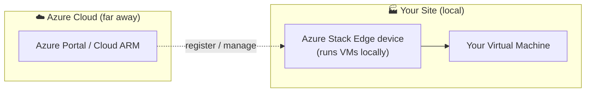
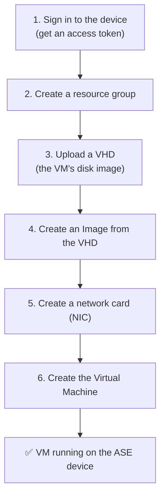
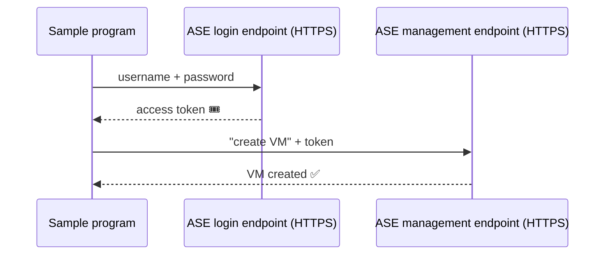
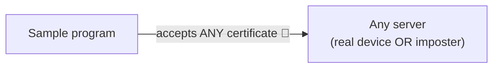
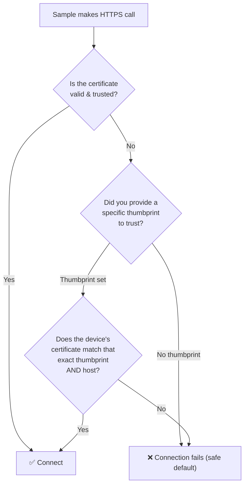
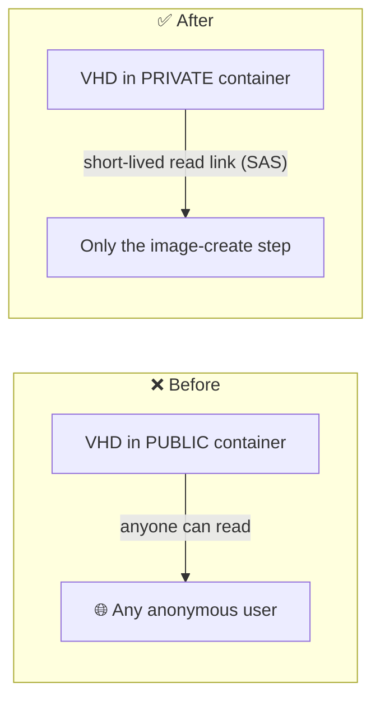
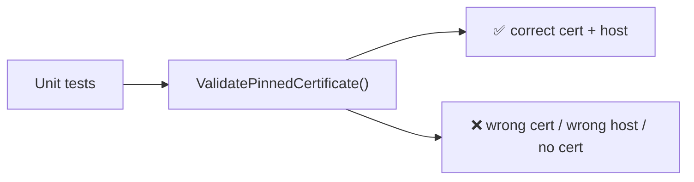

# Azure Stack Edge (ASE) VM Sample — Explained Simply

New to Azure Stack Edge? Start here. This doc explains, in plain language, what the
affected sample does, why it exists, and what the recent security fixes changed.

---

## 1. What is Azure Stack Edge, in one picture?

Azure Stack Edge (ASE) is a **physical appliance** Microsoft ships to your location
(a factory, a store, a ship, a remote site). It runs a small slice of Azure **locally**,
so you can run virtual machines (VMs) and containers close to your data — even with poor
or no internet.

Think of it as **"a tiny piece of Azure that lives in your building."**



Key idea: the device has its **own local ARM** (Azure Resource Manager). ARM is the
"control panel API" of Azure. Normally ARM lives in the cloud; on ASE, a copy runs
**on the box itself** so you can create resources locally.

---

## 2. What does this sample actually do?

The sample is a small program that **creates a virtual machine on the ASE device**.

It does not touch the public cloud to create the VM — it talks to the **local ARM
endpoint on the appliance**. The sample exists to show developers the exact steps and
API calls needed to automate VM creation on ASE.

There are several flavors of the same idea in this repo:

| Flavor | Folder | Language |
|--------|--------|----------|
| Local ARM (the one these fixes touch) | `dotnetSamples/LocalArm/CreateVmSample` | C# / .NET |
| Python script | `Scripts/PythonScript/example_ase.py` | Python |
| PowerShell | `Scripts/AzPowerShellScript` | PowerShell |

This doc focuses on the **C# LocalArm sample** and the **Python sample**, because those
are the two the security fixes changed.

---

## 3. The steps the sample performs

At a high level, creating a VM on ASE looks like this:



A **VHD** is just a file that contains a ready-made operating system disk (for example,
an Ubuntu or Windows disk). You upload it to the device's local storage, turn it into an
**image**, and then create VMs from that image.

---

## 4. How sign-in works (and where the certificate fits)

To talk to the device, the sample must first **prove who it is** and get a token. It
contacts two HTTPS endpoints **on the appliance**:

- the **login endpoint** (ADFS): `https://login.dbe-<appliance>.microsoftdatabox.com/adfs/`
- the **management endpoint** (local ARM): `https://management.dbe-<appliance>.microsoftdatabox.com/`



Because these calls are **HTTPS**, the device presents a **TLS certificate** — a digital
ID card that proves "you are really talking to the appliance and not an imposter." Your
computer normally checks that ID card automatically.

---

## 5. The security problem that was fixed (certificate change)

### What the old code did

The original sample **turned off certificate checking completely** — for the whole
program. It effectively said: *"accept any HTTPS certificate, always, no questions asked."*



That made setup easy, but it is dangerous: if an attacker sat between you and the device,
your program would happily send your **username, password, and access token** to the
attacker, because it never verified who it was talking to. This is called a
**man-in-the-middle (MITM)** attack.

### What the fix does

The blanket "accept everything" switch is **removed**. Now:



Two ways to connect now, both safe:

1. **Normal (recommended):** trust the appliance certificate properly on your machine
   (install the device/root certificate), then the sample "just works" with full validation.
2. **Pinned exception (opt-in):** if you must trust a specific device certificate (common
   in labs or private setups), you provide its **thumbprint** — a unique fingerprint of
   that one certificate. The sample will then trust **only** that exact certificate, and
   **only** for the ASE login/management hosts. Everything else is still rejected.

A **thumbprint** is like the certificate's unique serial number. Trusting one thumbprint
is very different from "trust everything" — it is a single, specific ID you have chosen in
advance.

### How you use the opt-in in the sample

In `Program.cs` there is now a clearly labeled field:

```csharp
// Optional appliance certificate thumbprint.
// Leave this blank to use normal TLS validation.
// Set it only when you need to trust a specific ASE certificate.
var applianceCertificateThumbprint = "";
```

- Leave it **empty** → normal, full certificate validation.
- Paste the device's certificate **thumbprint** → trust only that certificate for the ASE
  endpoints.

You can read the thumbprint from the ASE local UI, or with:
`openssl s_client -connect management.dbe-<appliance>.microsoftdatabox.com:443`

---

## 6. The second fix (Python storage change)

The Python sample uploads the VHD to a storage container on the device. The old code made
that container **public** — anyone who could reach it could read the VM disk image.



The fix keeps the container **private** and instead generates a **SAS** (Shared Access
Signature) — a temporary, read-only link that expires after one hour and is only used to
create the image. No more public exposure of your disk image.

---

## 7. How this is tested

The certificate-pinning logic now has **automated unit tests** (MSTest) that verify:

- with no errors, a valid certificate is accepted;
- a matching thumbprint on an allowed ASE host is accepted, even with a chain warning;
- a **wrong** thumbprint, a **wrong** host, a **missing** certificate, or an **unknown
  caller type** are all rejected.

This proves the safe behavior holds without needing a physical device.



---

## 8. Summary in one line

The sample **creates a VM on your local Azure Stack Edge box**; the fixes make it **verify
who it is talking to** (instead of trusting any certificate) and **stop exposing the VM
disk image publicly** — while still giving you a safe, opt-in way to trust a specific
device certificate.
